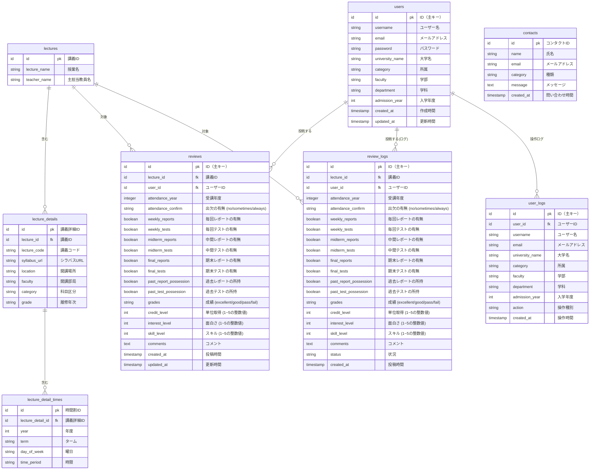

# データベース設計

## 概要

Kaede プロジェクトのデータベース設計です。講義レビューシステムのためのテーブル構成とリレーションを定義しています。

## ER 図



## テーブル定義

### 1. users（ユーザーテーブル）

ユーザー情報を管理するテーブルです。Django の標準的な命名規則に従って定義。

| フィールド名            | データ型          | NULL許可 | BLANK許可 | 主キー | 一意制約 | デフォルト値 | 最大長 | 説明           |
| ----------------- | ------------- | ------ | ------- | --- | ---- | ------ | --- | ------------ |
| `id`              | AutoField     | ✕      | ✕       | ✅   | ✅  |        |     | ID（主キー）      |
| `username`        | CharField     | ✕      | ✕       | ✕   | ✕    |        | 50    | ユーザー名        |
| `email`           | EmailField     | ✕      | ✕       | ✕   | ✅    |        | 254    | メールアドレス      |
| `password`        | CharField     | ✕      | ✕       | ✕   | ✕    |        | 128    | パスワード（ハッシュ化） |
| `university_name` | CharField     | ✕      | ✅      | ✕   | ✕    |        | 100    | 大学名          |
| `category`        | CharField     | ✕      | ✕       | ✕   | ✕    |        | 100    | 所属           |
| `faculty`         | CharField     | ✕      | ✅      | ✕   | ✕    |        | 100    | 学部           |
| `department`      | CharField     | ✕      | ✅      | ✕   | ✕    |        | 100    | 学科           |
| `admission_year`  | IntegerField  | ✅     | ✅      | ✕   | ✕    |        |     | 入学年度         |
| `created_at`      | DateTimeField | ✕      | ✕       | ✕   | ✕    |        |     | 作成時間         |
| `updated_at`      | DateTimeField | ✕      | ✕       | ✕   | ✕    |        |     | 更新時間         |

### 2. user_logs（ユーザーログテーブル）

ユーザーの操作履歴を管理するテーブルです。

| フィールド名            | データ型          | NULL許可 | BLANK許可 | 主キー | 一意制約 | デフォルト値 | 最大長 | 説明                         |
| ----------------- | ------------- | ------ | ------- | --- | ---- | ------ | --- | -------------------------- |
| `id`              | AutoField     | ✕      | ✕       | ✅   | ✅    |        |     | ID（主キー）                    |
| `user_id`         | ForeignKey    | ✕      | ✕       | ✕   | ✕    |        |     | ユーザー ID（外部キー）              |
| `username`        | CharField     | ✕      | ✕       | ✕   | ✕    |        | 50  | ユーザー名        |
| `email`           | EmailField     | ✕      | ✕       | ✕   | ✅    |        |  254 | メールアドレス      |
| `university_name` | CharField     | ✕      | ✅      | ✕   | ✕    |        | 100    | 大学名          |
| `category`        | CharField     | ✕      | ✕       | ✕   | ✕    |        | 100 | 所属           |
| `faculty`         | CharField     | ✕      | ✅      | ✕   | ✕    |        | 100 | 学部           |
| `department`      | CharField     | ✕      | ✅      | ✕   | ✕    |        | 100 | 学科           |
| `admission_year`  | IntegerField  | ✅     | ✅      | ✕   | ✕    |        |     | 入学年度         |
| `action`          | CharField     | ✕      | ✕       | ✕   | ✕    |        | 20  | 操作種別（create/update/delete） |
| `created_at`      | DateTimeField | ✕      | ✕       | ✕   | ✕    |        |     | 操作時間                       |

### 3. lectures（講義テーブル）

講義の基本情報を管理するテーブルです。

| フィールド名         | データ型          | NULL許可 | BLANK許可 | 主キー | 一意制約 | デフォルト値 | 最大長 | 説明     |
| -------------- | ------------- | ------ | ------- | --- | ---- | ------ | --- | ------ |
| `id`           | AutoField     | ✕      | ✕       | ✅   | ✅   |        |     | 講義 ID  |
| `lecture_name` | CharField     | ✕      | ✕       | ✕   | ✕    |        | 100 | 授業名    |
| `teacher_name` | CharField     | ✕      | ✕       | ✕   | ✕    |        | 100 | 主担当教員名 |
| `created_at`   | DateTimeField | ✕      | ✕       | ✕   | ✕    |        |     | 作成時間   |
| `updated_at`   | DateTimeField | ✕      | ✕       | ✕   | ✕    |        |     | 更新時間   |

### 4. lecture_details（講義詳細テーブル）

講義の詳細情報を管理するテーブルです。

| フィールド名         | データ型          | NULL許可 | BLANK許可 | 主キー | 一意制約 | デフォルト値 | 最大長 | 説明          |
| -------------- | ------------- | ------ | ------- | --- | ---- | ------ | --- | ----------- |
| `id`           | AutoField     | ✕      | ✕       | ✅   | ✅    |        |     | 講義詳細 ID     |
| `lecture_id`   | ForeignKey    | ✕      | ✕       | ✕   | ✕    |        |     | 講義 ID（外部キー） |
| `lecture_code` | CharField     | ✕      | ✕       | ✕   | ✕    |        | 20  | 講義コード       |
| `syllabus_url` | URLField     | ✕      | ✕       | ✕   | ✕    |        | 200 | シラバス URL    |
| `location`     | CharField     | ✕      | ✕       | ✕   | ✕    |        | 100 | 開講場所        |
| `faculty`      | CharField     | ✕      | ✕       | ✕   | ✕    |        | 100 | 開講部局        |
| `category`     | CharField     | ✕      | ✕       | ✕   | ✕    |        | 100 | 科目区分        |
| `grade`        | CharField     | ✕      | ✕       | ✕   | ✕    |        | 20  | 履修年次        |
| `created_at`   | DateTimeField | ✕      | ✕       | ✕   | ✕    |        |     | 作成時間        |
| `updated_at`   | DateTimeField | ✕      | ✕       | ✕   | ✕    |        |     | 更新時間        |

### 5. lecture_detail_times（講義時間割テーブル）

講義の時間割情報を管理するテーブルです。

| フィールド名              | データ型          | NULL許可 | BLANK許可 | 主キー | 一意制約 | デフォルト値 | 最大長 | 説明            |
| ------------------- | ------------- | ------ | ------- | --- | ---- | ------ | --- | ------------- |
| `id`                | AutoField     | ✕      | ✕       | ✅   | ✅    |        |     | 時間割 ID        |
| `lecture_detail_id` | ForeignKey    | ✕      | ✕       | ✕   | ✕    |        |     | 講義詳細 ID（外部キー） |
| `year`              | IntegerField  | ✕      | ✕       | ✕   | ✕    |        |     | 年度            |
| `term`              | CharField     | ✕      | ✕       | ✕   | ✕    |        | 20   | ターム（学期）       |
| `day_of_week`       | CharField     | ✕      | ✕       | ✕   | ✕    |        | 20   | 曜日            |
| `time_period`       | CharField     | ✕      | ✕       | ✕   | ✕    |        | 20   | 時限            |
| `created_at`        | DateTimeField | ✕      | ✕       | ✕   | ✕    |        |     | 作成時間          |
| `updated_at`        | DateTimeField | ✕      | ✕       | ✕   | ✕    |        |     | 更新時間          |

### 6. reviews（レビューテーブル）

講義レビューを管理するテーブルです。

| フィールド名                 | データ型          | NULL許可 | BLANK許可 | 主キー | 一意制約 | デフォルト値 | 最大長 | 説明            |
| ---------------------- | ------------- | ------ | ------- | --- | ---- | ------ | --- | ------------- |
| `id`                   | AutoField     | ✕      | ✕       | ✅   | ✅    |        |     | ID（主キー）       |
| `lecture_id`           | ForeignKey    | ✕      | ✕       | ✕   | ✕    |        |     | 講義 ID（外部キー）   |
| `user_id`              | ForeignKey    | ✕      | ✕       | ✕   | ✕    |        |     | ユーザー ID（外部キー） |
| `attendance_year`      | IntegerField  | ✅      | ✅       | ✕   | ✕    |        |     | 受講年度          |
| `attendance_confirm`   | CharField     | ✕       | ✅       | ✕   | ✕    |        |  20   | 出欠の有無 (no/sometimes/always)         |
| `weekly_reports`       | BooleanField  | ✅      | ✅       | ✕   | ✕    |        |       | 毎回レポートの有無   |
| `weekly_tests`         | BooleanField  | ✅      | ✅       | ✕   | ✕    |        |       | 毎回テストの有無     |
| `midterm_reports`      | BooleanField  | ✅      | ✅       | ✕   | ✕    |        |       | 中間レポートの有無   |
| `midterm_tests`        | BooleanField  | ✅      | ✅       | ✕   | ✕    |        |       | 中間テストの有無     |
| `final_reports`        | BooleanField  | ✅      | ✅       | ✕   | ✕    |        |       | 期末レポートの有無   |
| `final_tests`          | BooleanField  | ✅      | ✅       | ✕   | ✕    |        |       | 期末テストの有無     |
| `past_report_possession` | BooleanField  | ✅      | ✅       | ✕   | ✕    |        |       | 過去レポートの所持   |
| `past_test_possession`   | BooleanField  | ✅      | ✅       | ✕   | ✕    |        |       | 過去テストの所持     |
| `grades`               | CharField     | ✕       | ✅       | ✕   | ✕    |        |  20   | 成績 (excellent/good/pass/fail) |
| `credit_level`         | IntegerField  | ✅      | ✅       | ✕   | ✕    |        |     | 単位取得 (1~5の整数値) |
| `interest_level`       | IntegerField  | ✅      | ✅       | ✕   | ✕    |        |     | 面白さ (1~5の整数値) |
| `skill_level`          | IntegerField  | ✅      | ✅       | ✕   | ✕    |        |     | スキル (1~5の整数値) |
| `comments`             | TextField     | ✕      | ✅       | ✕   | ✕    |        | 1000   | コメント          |
| `created_at`           | DateTimeField | ✕      | ✕       | ✕   | ✕    |        |     | 投稿時間          |
| `updated_at`           | DateTimeField | ✕      | ✕       | ✕   | ✕    |        |     | 更新時間          |

### 7. review_logs（レビューログテーブル）

レビューの変更履歴を管理するテーブルです。

| フィールド名                 | データ型          | NULL許可 | BLANK許可 | 主キー | 一意制約 | デフォルト値 | 最大長 | 説明            |
| ---------------------- | ------------- | ------ | ------- | --- | ---- | ------ | --- | ------------- |
| `id`                   | AutoField     | ✕      | ✕       | ✅   | ✅    |        |     | ID（主キー）       |
| `lecture_id`           | ForeignKey    | ✕      | ✕       | ✕   | ✕    |        |     | 講義 ID（外部キー）   |
| `user_id`              | ForeignKey    | ✕      | ✕       | ✕   | ✕    |        |     | ユーザー ID（外部キー） |
| `attendance_year`      | IntegerField  | ✅      | ✅       | ✕   | ✕    |        |     | 受講年度          |
| `attendance_confirm`   | CharField     | ✕       | ✅       | ✕   | ✕    |        |  20   | 出欠の有無 (no/sometimes/always)         |
| `weekly_reports`       | BooleanField  | ✅      | ✅       | ✕   | ✕    |        |       | 毎回レポートの有無   |
| `weekly_tests`         | BooleanField  | ✅      | ✅       | ✕   | ✕    |        |       | 毎回テストの有無     |
| `midterm_reports`      | BooleanField  | ✅      | ✅       | ✕   | ✕    |        |       | 中間レポートの有無   |
| `midterm_tests`        | BooleanField  | ✅      | ✅       | ✕   | ✕    |        |       | 中間テストの有無     |
| `final_reports`        | BooleanField  | ✅      | ✅       | ✕   | ✕    |        |       | 期末レポートの有無   |
| `final_tests`          | BooleanField  | ✅      | ✅       | ✕   | ✕    |        |       | 期末テストの有無     |
| `past_report_possession` | BooleanField  | ✅      | ✅       | ✕   | ✕    |        |       | 過去レポートの所持   |
| `past_test_possession`   | BooleanField  | ✅      | ✅       | ✕   | ✕    |        |       | 過去テストの所持     |
| `grades`               | CharField     | ✕       | ✅       | ✕   | ✕    |        |  20   | 成績 (excellent/good/pass/fail) |
| `credit_level`         | IntegerField  | ✅      | ✅       | ✕   | ✕    |        |     | 単位取得 (1~5の整数値) |
| `interest_level`       | IntegerField  | ✅      | ✅       | ✕   | ✕    |        |     | 面白さ (1~5の整数値) |
| `skill_level`          | IntegerField  | ✅      | ✅       | ✕   | ✕    |        |     | スキル (1~5の整数値) |
| `comments`             | TextField     | ✕      | ✅       | ✕   | ✕    |        | 1000    | コメント          |
| `created_at`           | DateTimeField | ✕      | ✕       | ✕   | ✕    |        |     | 投稿時間          |
| `status`               | CharField     | ✅      | ✅       | ✕   | ✕    |        |  20   | 操作種別（create/update/delete）  |

### 8. contacts（お問い合わせテーブル）

お問い合わせを管理するテーブルです。

| フィールド名       | データ型          | NULL許可 | BLANK許可 | 主キー | 一意制約 | デフォルト値 | 最大長 | 説明       |
| ------------ | ------------- | ------ | ------- | --- | ---- | ------ | --- | -------- |
| `id`         | AutoField     | ✕      | ✕       | ✅   | ✕    |        |     | コンタクト ID |
| `name`       | CharField     | ✕      | ✕       | ✕   | ✕    |        | 50    | 氏名       |
| `email`      | EmailField     | ✕      | ✕       | ✕   | ✕    |        | 254    | メールアドレス  |
| `category`   | CharField     | ✕      | ✅       | ✕   | ✕    |        | 50    | 種類（任意項目） |
| `message`    | TextField     | ✕      | ✕       | ✕   | ✕    |        | 2000    | メッセージ内容  |
| `created_at` | DateTimeField | ✕      | ✕       | ✕   | ✕    |        |     | 問い合わせ時間  |

## リレーション

### 主要なリレーション

1. **lectures → lecture_details**: 1 対多

   - 1 つの講義に対して複数の詳細情報

2. **lecture_details → lecture_detail_times**: 1 対多

   - 1 つの講義詳細に対して複数の時間割

3. **users → reviews**: 1 対多

   - 1 人のユーザーが複数のレビューを投稿

4. **lectures → reviews**: 1 対多

   - 1 つの講義に対して複数のレビュー

5. **users → user_logs**: 1 対多
   - 1 人のユーザーに対して複数の操作ログ

### 制約

- **外部キー制約**: 参照整合性を保証
- **ユニーク制約**: メールアドレスの重複防止
- **NOT NULL 制約**: 必須項目の保証

## インデックス戦略

### 推奨インデックス

```sql
-- 検索性能向上のためのインデックス
CREATE INDEX idx_reviews_lecture_id ON reviews(lecture_id);
CREATE INDEX idx_reviews_user_id ON reviews(user_id);
CREATE INDEX idx_reviews_created_at ON reviews(created_at);

CREATE INDEX idx_user_logs_user_id ON user_logs(user_id);
CREATE INDEX idx_user_logs_action ON user_logs(action);
CREATE INDEX idx_user_logs_created_at ON user_logs(created_at);

-- ユーザー検索用
CREATE INDEX idx_users_email ON users(email);
CREATE INDEX idx_users_university ON users(university_name);
```

## データ型の詳細

### 数値型

- `int`: 整数値（年度、レベル評価など）
- `integer`: 大きな整数値
- `increments`: 自動増分 ID

### 文字列型

- `string`: 短い文字列（VARCHAR 相当）
- `text`: 長い文字列（TEXT 相当）

### 日時型

- `timestamp`: 日時情報

### その他

- `boolean`: 真偽値

## Django 命名規則との対応

### テーブル名

- Django: `snake_case` (例: `lecture_details`)

### カラム名

- Django: `snake_case` (例: `lecture_name`)

### 主キー

- Django: `id` (AutoField)

### タイムスタンプ

- Django: `created_at`, `updated_at`

## セキュリティ考慮事項

1. **パスワード**: ハッシュ化して保存
2. **個人情報**: 適切な暗号化・アクセス制御
3. **ログ管理**: レビュー変更履歴の保持
4. **削除リクエスト**: 不適切なコンテンツの報告機能

## マイグレーション戦略

### Django 標準命名規則

1. **テーブル名**: snake_case
2. **カラム名**: snake_case
3. **データ型**: Django 標準
4. **リレーション**: 外部キー制約の維持

### 推奨マイグレーション手順

```bash
# 1. マイグレーションファイル作成
python manage.py makemigrations

# 2. マイグレーション適用
python manage.py migrate

# 3. データ移行（必要に応じて）
python manage.py loaddata initial_data.json
```
