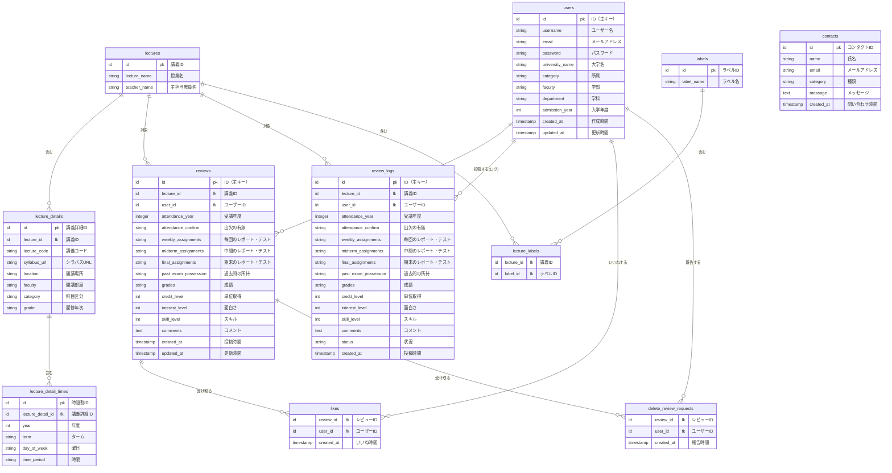

# データベース設計

## 概要

Kaedeプロジェクトのデータベース設計です。講義レビューシステムのためのテーブル構成とリレーションを定義しています。

## ER図



## テーブル定義

### 1. lectures（講義テーブル）

講義の基本情報を管理するテーブルです。

| カラム名 | データ型 | 制約 | 説明 |
|---------|---------|------|------|
| `id` | `increments` | `PRIMARY KEY` | 講義ID |
| `lecture_name` | `string` | `NOT NULL` | 授業名 |
| `teacher_name` | `string` | `NOT NULL` | 主担当教員名 |
| `created_at` | `timestamp` | `NOT NULL` | 作成時間 |
| `updated_at` | `timestamp` | `NOT NULL` | 更新時間 |

### 2. lecture_details（講義詳細テーブル）

講義の詳細情報を管理するテーブルです。

| カラム名 | データ型 | 制約 | 説明 |
|---------|---------|------|------|
| `id` | `increments` | `PRIMARY KEY` | 講義詳細ID |
| `lecture_id` | `id` | `FOREIGN KEY` | 講義ID |
| `lecture_code` | `string` | `NOT NULL` | 講義コード |
| `syllabus_url` | `string` | - | シラバスURL |
| `location` | `string` | - | 開講場所 |
| `faculty` | `string` | - | 開講部局 |
| `category` | `string` | - | 科目区分 |
| `grade` | `string` | - | 履修年次 |
| `created_at` | `timestamp` | `NOT NULL` | 作成時間 |
| `updated_at` | `timestamp` | `NOT NULL` | 更新時間 |

### 3. lecture_detail_times（講義時間割テーブル）

講義の時間割情報を管理するテーブルです。

| カラム名 | データ型 | 制約 | 説明 |
|---------|---------|------|------|
| `id` | `increments` | `PRIMARY KEY` | 時間割ID |
| `lecture_detail_id` | `id` | `FOREIGN KEY` | 講義詳細ID |
| `year` | `int` | `NOT NULL` | 年度 |
| `term` | `string` | `NOT NULL` | ターム |
| `day_of_week` | `string` | `NOT NULL` | 曜日 |
| `time_period` | `string` | `NOT NULL` | 時限 |
| `created_at` | `timestamp` | `NOT NULL` | 作成時間 |
| `updated_at` | `timestamp` | `NOT NULL` | 更新時間 |

### 4. users（ユーザーテーブル）

ユーザー情報を管理するテーブルです。Djangoの標準的な命名規則に従って定義。

| カラム名 | データ型 | 制約 | 説明 |
|---------|---------|------|------|
| `id` | `increments` | `PRIMARY KEY` | ID（主キー） |
| `username` | `string` | `NOT NULL` | ユーザー名 |
| `email` | `string` | `UNIQUE, NOT NULL` | メールアドレス |
| `password` | `string` | `NOT NULL` | パスワード（ハッシュ化） |
| `university_name` | `string` | `NOT NULL` | 大学名 |
| `category` | `string` | `NOT NULL` | 所属 |
| `faculty` | `string` | `NOT NULL` | 学部 |
| `department` | `string` | `NOT NULL` | 学科 |
| `admission_year` | `int` | `NOT NULL` | 入学年度 |
| `created_at` | `timestamp` | `NOT NULL` | 作成時間 |
| `updated_at` | `timestamp` | `NOT NULL` | 更新時間 |

### 5. reviews（レビューテーブル）

講義レビューを管理するテーブルです。

| カラム名 | データ型 | 制約 | 説明 |
|---------|---------|------|------|
| `id` | `increments` | `PRIMARY KEY` | ID（主キー） |
| `lecture_id` | `id` | `FOREIGN KEY` | 講義ID |
| `user_id` | `id` | `FOREIGN KEY` | ユーザーID |
| `attendance_year` | `integer` | - | 受講年度 |
| `attendance_confirm` | `string` | - | 出欠の有無 |
| `weekly_assignments` | `string` | - | 毎回のレポート・テスト |
| `midterm_assignments` | `string` | - | 中間のレポート・テスト |
| `final_assignments` | `string` | - | 期末のレポート・テスト |
| `past_exam_possession` | `string` | - | 過去問の所持 |
| `grades` | `string` | - | 成績 |
| `credit_level` | `int` | - | 単位取得 |
| `interest_level` | `int` | - | 面白さ |
| `skill_level` | `int` | - | スキル |
| `comments` | `text` | - | コメント |
| `created_at` | `timestamp` | `NOT NULL` | 投稿時間 |
| `updated_at` | `timestamp` | `NOT NULL` | 更新時間 |

### 6. review_logs（レビューログテーブル）

レビューの変更履歴を管理するテーブルです。

| カラム名 | データ型 | 制約 | 説明 |
|---------|---------|------|------|
| `id` | `increments` | `PRIMARY KEY` | ID（主キー） |
| `lecture_id` | `id` | `FOREIGN KEY` | 講義ID |
| `user_id` | `id` | `FOREIGN KEY` | ユーザーID |
| `attendance_year` | `integer` | - | 受講年度 |
| `attendance_confirm` | `string` | - | 出欠の有無 |
| `weekly_assignments` | `string` | - | 毎回のレポート・テスト |
| `midterm_assignments` | `string` | - | 中間のレポート・テスト |
| `final_assignments` | `string` | - | 期末のレポート・テスト |
| `past_exam_possession` | `string` | - | 過去問の所持 |
| `grades` | `string` | - | 成績 |
| `credit_level` | `int` | - | 単位取得 |
| `interest_level` | `int` | - | 面白さ |
| `skill_level` | `int` | - | スキル |
| `comments` | `text` | - | コメント |
| `status` | `string` | - | 状況 |
| `created_at` | `timestamp` | `NOT NULL` | 投稿時間 |

### 7. labels（ラベルテーブル）

講義のラベルを管理するテーブルです。

| カラム名 | データ型 | 制約 | 説明 |
|---------|---------|------|------|
| `id` | `increments` | `PRIMARY KEY` | ラベルID |
| `label_name` | `string` | `UNIQUE, NOT NULL` | ラベル名 |
| `created_at` | `timestamp` | `NOT NULL` | 作成時間 |
| `updated_at` | `timestamp` | `NOT NULL` | 更新時間 |

### 8. lecture_labels（講義ラベル関連テーブル）

講義とラベルの多対多関係を管理するテーブルです。

| カラム名 | データ型 | 制約 | 説明 |
|---------|---------|------|------|
| `lecture_id` | `id` | `FOREIGN KEY` | 講義ID |
| `label_id` | `id` | `FOREIGN KEY` | ラベルID |

### 9. likes（いいねテーブル）

レビューへのいいねを管理するテーブルです。

| カラム名 | データ型 | 制約 | 説明 |
|---------|---------|------|------|
| `review_id` | `id` | `FOREIGN KEY` | レビューID |
| `user_id` | `id` | `FOREIGN KEY` | ユーザーID |
| `created_at` | `timestamp` | `NOT NULL` | いいね時間 |

### 10. delete_review_requests（レビュー削除リクエストテーブル）

レビューの削除リクエストを管理するテーブルです。

| カラム名 | データ型 | 制約 | 説明 |
|---------|---------|------|------|
| `review_id` | `id` | `FOREIGN KEY` | レビューID |
| `user_id` | `id` | `FOREIGN KEY` | ユーザーID |
| `created_at` | `timestamp` | `NOT NULL` | 報告時間 |

### 11. contacts（お問い合わせテーブル）

お問い合わせを管理するテーブルです。

| カラム名 | データ型 | 制約 | 説明 |
|---------|---------|------|------|
| `id` | `increments` | `PRIMARY KEY` | コンタクトID |
| `name` | `string` | `NOT NULL` | 氏名 |
| `email` | `string` | `NOT NULL` | メールアドレス |
| `category` | `string` | - | 種類 |
| `message` | `text` | `NOT NULL` | メッセージ |
| `created_at` | `timestamp` | `NOT NULL` | 問い合わせ時間 |

## リレーション

### 主要なリレーション

1. **lectures → lecture_details**: 1対多
   - 1つの講義に対して複数の詳細情報

2. **lecture_details → lecture_detail_times**: 1対多
   - 1つの講義詳細に対して複数の時間割

3. **users → reviews**: 1対多
   - 1人のユーザーが複数のレビューを投稿

4. **lectures → reviews**: 1対多
   - 1つの講義に対して複数のレビュー

5. **reviews → likes**: 1対多
   - 1つのレビューに対して複数のいいね

6. **lectures ↔ labels**: 多対多（lecture_labels経由）
   - 1つの講義に複数のラベル、1つのラベルが複数の講義に付与

### 制約

- **外部キー制約**: 参照整合性を保証
- **ユニーク制約**: メールアドレス、ラベル名の重複防止
- **NOT NULL制約**: 必須項目の保証

## インデックス戦略

### 推奨インデックス

```sql
-- 検索性能向上のためのインデックス
CREATE INDEX idx_reviews_lecture_id ON reviews(lecture_id);
CREATE INDEX idx_reviews_user_id ON reviews(user_id);
CREATE INDEX idx_reviews_created_at ON reviews(created_at);

CREATE INDEX idx_likes_review_id ON likes(review_id);
CREATE INDEX idx_likes_user_id ON likes(user_id);

CREATE INDEX idx_lecture_labels_lecture_id ON lecture_labels(lecture_id);
CREATE INDEX idx_lecture_labels_label_id ON lecture_labels(label_id);

-- ユーザー検索用
CREATE INDEX idx_users_email ON users(email);
CREATE INDEX idx_users_university ON users(university_name);
```

## データ型の詳細

### 数値型
- `int`: 整数値（年度、レベル評価など）
- `integer`: 大きな整数値
- `increments`: 自動増分ID

### 文字列型
- `string`: 短い文字列（VARCHAR相当）
- `text`: 長い文字列（TEXT相当）

### 日時型
- `timestamp`: 日時情報

### その他
- `boolean`: 真偽値

## Django命名規則との対応

### テーブル名
- Django: `snake_case` (例: `lecture_details`)

### カラム名
- Django: `snake_case` (例: `lecture_name`)

### 主キー
- Django: `id` (AutoField)

### タイムスタンプ
- Django: `created_at`, `updated_at`

## セキュリティ考慮事項

1. **パスワード**: ハッシュ化して保存
2. **個人情報**: 適切な暗号化・アクセス制御
3. **ログ管理**: レビュー変更履歴の保持
4. **削除リクエスト**: 不適切なコンテンツの報告機能

## マイグレーション戦略

### Django標準命名規則

1. **テーブル名**: snake_case
2. **カラム名**: snake_case
3. **データ型**: Django標準
4. **リレーション**: 外部キー制約の維持

### 推奨マイグレーション手順

```bash
# 1. マイグレーションファイル作成
python manage.py makemigrations

# 2. マイグレーション適用
python manage.py migrate

# 3. データ移行（必要に応じて）
python manage.py loaddata initial_data.json
```
